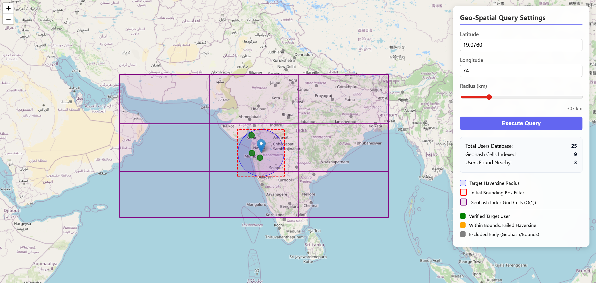

# Phase 3: Geohash Spatial Indexing

In Phase 2, we reduced math computation but still iterated through `O(N)` records to apply our bounding box check. Phase 3 fundamentally shifts our architecture to an `O(K)` dictionary lookup style using a spatial index.

## What is a Geohash?
A Geohash encodes a geographic area (latitude/longitude) into a short string of characters. 
- A precision of 1 character splits the world into a massive grid of giant squares.
- A precision of 5 characters gives us roughly a 5km x 5km square.
- A precision of 6 characters narrows it down to about 1.2km x 0.6km squares.

Because it represents an area rather than a point, nearby points share the exact same prefix string!

## O(K) Spatial Lookup
During application startup (`internal/store/memory_store.go`), we pre-compute geohashes of all users for multiple precision sizes (1 through 6) and place them inside a nested hash map:
`GeohashIndex: map[uint]map[string][]models.User`

Now, when a user queries for a target point and radius:
1. We determine the appropriate precision level (e.g., precision 4 for a 10km radius) so that a 3x3 grid (9 Geohash squares) entirely covers the search radius without fetching too much excess.
2. We calculate the target Geohash for the search center.
3. We calculate its 8 bordering Geohashes.
4. We look up directly into `GeohashIndex[precision][hash]` to pull *only* those local candidate users into memory (`O(K)` complexity where K is the local volume of users, rather than the whole global database!).

## Workflow Pipeline
```text
Client Request (Lat, Lon, Radius)
  ↓
Calculate Optimal Geohash Precision Block Size (length 1 to 6)
  ↓
Lookup Center Block + 8 Neighbor Blocks in Memory Store Hashmap -> O(1) hashmap operation
  ↓
Bounding Box checks on the candidate users returned by the hashmap
  ↓
Haversine mathematical calculation on surviving candidates
```

The computational shift away from iterating over N coordinates allows massive user bases to scale flawlessly.

## Limitations & Edge Cases

While Geohashing reduces a massive `O(N)` database scan to an `O(1)` grid lookup, it has a few notable trade-offs:

### 1. The "Grid Boundary" Edge Case
Geohashes divide the world into fixed, non-overlapping squares. Two locations might be geographically just 1 meter apart, but if they happen to sit on the border of a major Geohash grid line, their Geohash strings will look completely different! 

To solve this, we cannot just query the *center* Geohash where the user is located. We **must** always compute and query the 8 surrounding neighbor grids. This guarantees that even if a user is standing on the edge of a cell, the search radius will naturally bleed into the neighboring cell and retrieve those candidates.

### 2. Over-fetching (The Corner Problem)
When we query a center grid and its 8 neighbors, we are retrieving a massive 3x3 square of users. However, the user is requesting a circular radius search. This means the four "corners" of that 3x3 grid will contain thousands of candidates who are guaranteed to be too far away, yet they are still fetched into memory. We still have to run the Bounding Box and Haversine math on them just to eliminate them.

### 3. Pole Distortions
Because the Earth is a sphere, Geohash rectangles near the equator are roughly equal in width and height, but as you move closer to the North or South poles, the grid cells become significantly distorted and stretched horizontally. This makes mapping a precise circular radius to a fixed grid size much less accurate at extreme latitudes.

