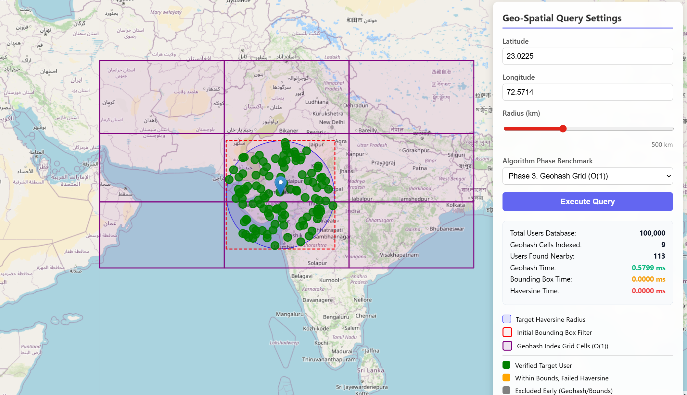

# Phase 4: Performance at Scale & Telemetry

In Phase 4, we scaled our application to handle an initial seed of **100,000 randomized users** globally. To ensure our server and frontend wouldn't crash under the weight of this large dataset, we implemented strict performance optimizations.

## Backend Telemetry
To measure the true efficiency of our $O(1)$ Geohash index, we added localized sub-millisecond execution timers to our `/nearby` endpoint. The API now returns a `timing` object:

```json
{
  "timing": {
    "s2_time": "0.1250 ms",
    "geohash_time": "0.4512 ms",
    "bounding_box_time": "0.0210 ms",
    "haversine_time": "0.0034 ms"
  }
}
```

### 1. Geohash Time
The geohash index time is generally bounded to under **1ms**. Instead of mathematical iteration, this is the time it takes the Go server to resolve the 9 matching geohash array slices in the inverted map index and merge them.

### 2. Bounding Box Time
Since the bounding box math only applies to the already highly-filtered geohash cell subset, execution typically measures in the low fractional millisecond range (~`0.0200 ms`).

### 3. Haversine Time
Haversine trigonometric formulas are computationally heavy. However, because we only run the Haversine function on the remaining fractional subset of candidates that survived the Bounding Box filter, this phase runs near-instantaneously (`0.0000 ms` to `0.0050 ms`).

---

## Frontend UI Bottleneck Removal
Originally, our `index.html` issued a `GET /users` request to paint all users gray across the map as reference dots. While acceptable for 100 users, attempting to plot 100,000 DOM elements immediately triggered memory exhaustion and browser tab crashes.

We completely removed the global `/users` fetch. Searching for a coordinate now natively visualizes the targeted boundary constraints (Purple Grid Cells -> Dashed Bounding Box -> Validated Target Points) without loading the rest of the unneeded Database.

The frontend interactive Stats panel was also updated to visualize the microsecond backend timings in real-time. By utilizing the `Algorithm Phase Benchmark` drop-down, developers can actually toggle the backend server to intentionally execute the un-optimized `$O(N)$` search phases (Naive Haversine & Naive Bounding Box) to directly compare execution latencies against the completed Geohash implementation on 100,000 DB records!


