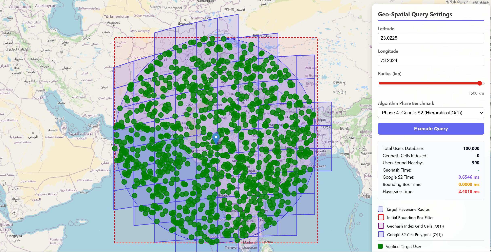

# Optimization Phase 4: Google S2 Indexing

## Overview
Google S2 is a library for spherical geometry that maps a three-dimensional sphere (the Earth) onto a two-dimensional plane using a combination of a cube projection and a Hilbert space-filling curve.

Unlike Geohash, which uses a rectangular grid on a 2D projection (Mercator), S2 works directly on the sphere, providing uniform cell sizes and better performance at the poles.

## Implementation Details
- **Dynamic S2 Levels**: We use an adaptive leveling strategy based on the search radius to prevent "cell explosion" while maintaining precision:
    - ≤ 1.3 km → Level 13 (~1.27 km²)
    - ≤ 2.6 km → Level 12
    - ≤ 5.3 km → Level 11
    - ... up to 170 km → Level 6
- **Indexing**: Each user's location is mapped to a 64-bit `uint64` S2 Cell ID. We store these in a `map[uint64][]User` for O(1) lookup.
- **Querying**: 
    1. An appropriate S2 level is chosen based on the radius.
    2. A `Cap` (spherical circle) is created around the query point.
    3. `RegionCoverer` identifies the set of S2 cells (up to 128 cells) that tile this circle.
    4. We retrieve all users from these cells in a single pass.
    5. Results are further refined using a standard Bounding Box and Haversine distance check.

## Visualization
The `GetS2CellPolygon` function returns a closed loop of 5 vertices for each cell, allowing the frontend to render the exact coverage area on the map.

